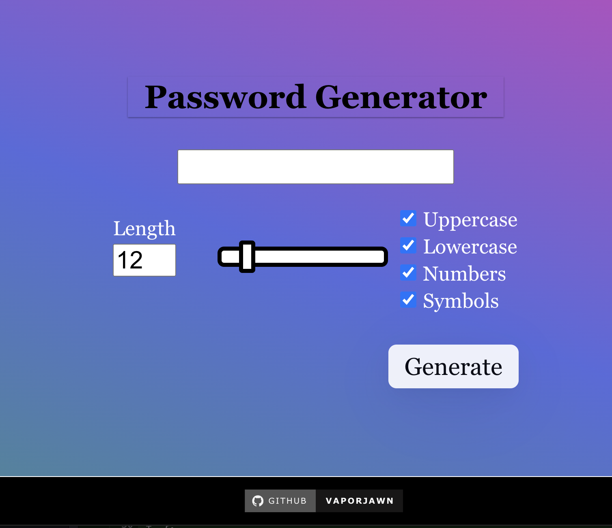

<div align="Center">

# Password Generator

This tool generates random passwords that meet your specific requirements. You can set parameters such as password length, the inclusion of uppercase and lowercase letters, numbers, and special characters. By inputting these parameters, the tool will create a unique and secure password for you. This is a great way to ensure that your passwords are strong and difficult to guess, which can help protect your personal information and online accounts from potential security breaches.

[](https://linkedin.com/in/victorwilliams719) [](https://instagram.com/Vaporjawn) [](https://twitter.com/Vaporjawn) [](https://twitch.tv/Vaporjawn) [](https://www.youtube.com/channel/UCK6-NQMyD3TREhUFU5Ithlg) [](https://steamcommunity.com/id/vaporjawn)



</div>

## Features

- Accessibility support
- Smooth gesture interactions
- Written in `TypeScript`
- Fully customizable
- Works on Windows, macOS, Linux
- Electron
- React

## Downloads

## Installation

```
npm install
```

```
npm start
```

It should serve to `localhost:3000`

## Author

- [Victor Williams](https://vaporjawn.github.io/)

## License

[MIT](./LICENSE)
